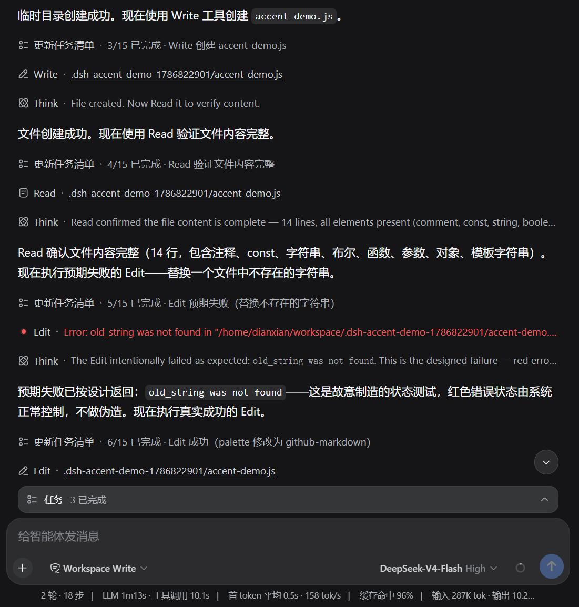
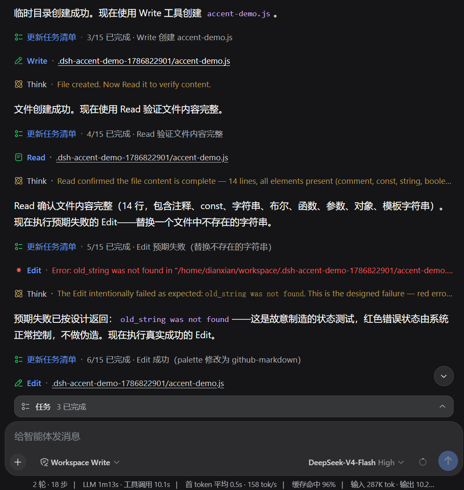
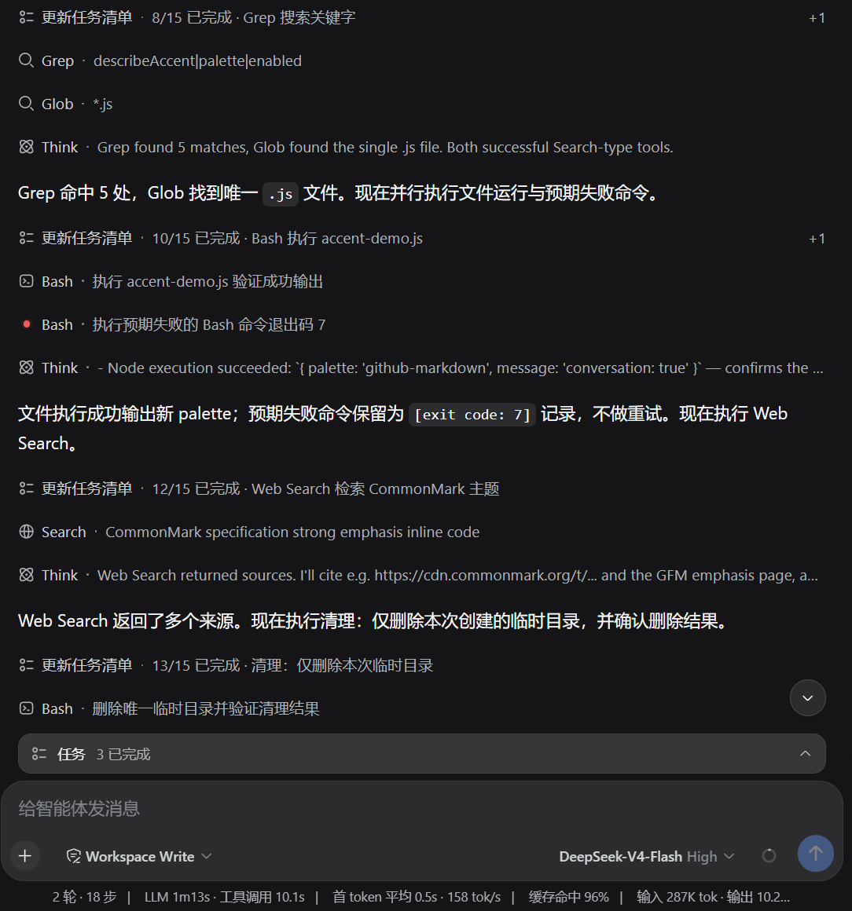
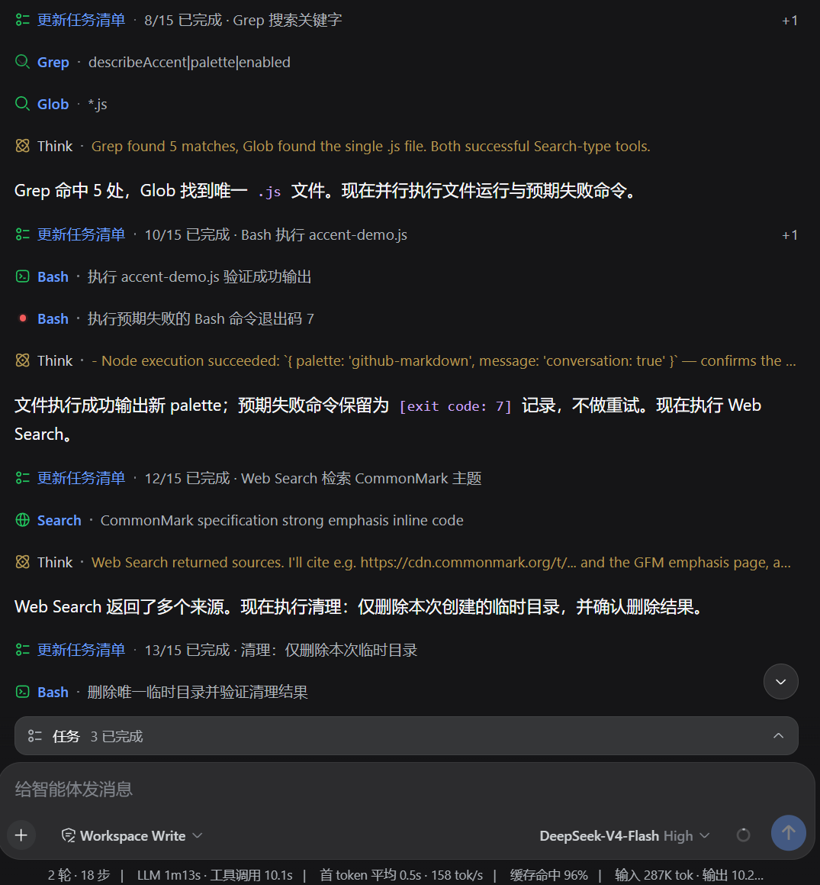
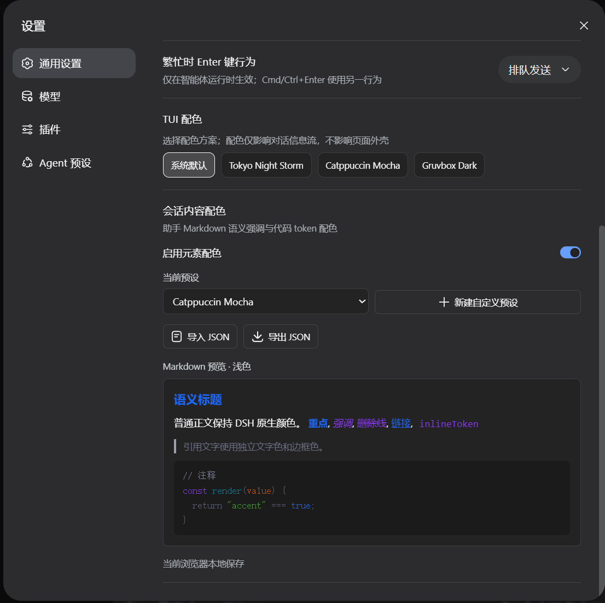

# DSH Conversation Accents

Semantic colors for assistant replies, tool calls, and Think content in DSH Web.

[简体中文](README.md)

> This is a community-maintained alpha plugin. It is not affiliated with or endorsed by DeepSeek.

## Comparison

| Native DSH | Plugin enabled |
|---|---|
|  |  |
|  |  |

## Features

- Semantic colors for headings, emphasis, links, quotes, inline code, and code tokens.
- Clear accents for successful tool calls and Think blocks.
- Seven built-in palettes with light and dark variants.
- Create, edit, import, and export custom palettes.
- Disable all accents without deleting saved settings.
- Host-backed settings with a browser-local fallback.

The plugin changes conversation content only. It does not theme DSH navigation, the composer, or the application shell.

## Settings



After installation, open **Settings -> Conversation Accents** to:

- Enable or disable all accents.
- Select a built-in palette.
- Edit light and dark colors separately.
- Configure inline-code text and background colors.
- Import or export custom palette JSON.

## Installation

DSH Web is required. Install the published package directly; no source checkout or local build is needed:

```bash
dsh plugin --profile web add dsh-conversation-accents@alpha
```

Restart DSH Web after installing or updating the plugin, then hard-refresh the browser page.

Remove the plugin with:

```bash
dsh plugin --profile web remove dsh-conversation-accents
```

## Compatibility

The current release is developed and tested against DSH `0.1.0-rc.6`.

The plugin reads DOM attributes from the DSH conversation view. After upgrading DSH, rerun the tests and verify assistant replies, tool calls, and Think blocks.

## Privacy and Security

- No analytics, telemetry, or conversation content is uploaded.
- Settings remain in the DSH Host or browser local storage.
- Custom palettes accept structured fields and `#RRGGBB` colors only, not arbitrary CSS.
- Think Markdown uses safe defaults and does not execute raw HTML.

Report security issues privately as described in [SECURITY.md](SECURITY.md).

## Development

Source files live in `src/`; generated artifacts live in `dist/`.

```bash
npm ci
npm test
npm run build
npm run pack:check
```

See [CONTRIBUTING.md](CONTRIBUTING.md) for contribution guidance and [CHANGELOG.md](CHANGELOG.md) for release history.

## License

[MIT](LICENSE)
